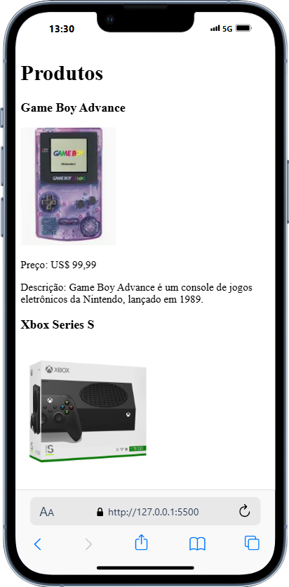
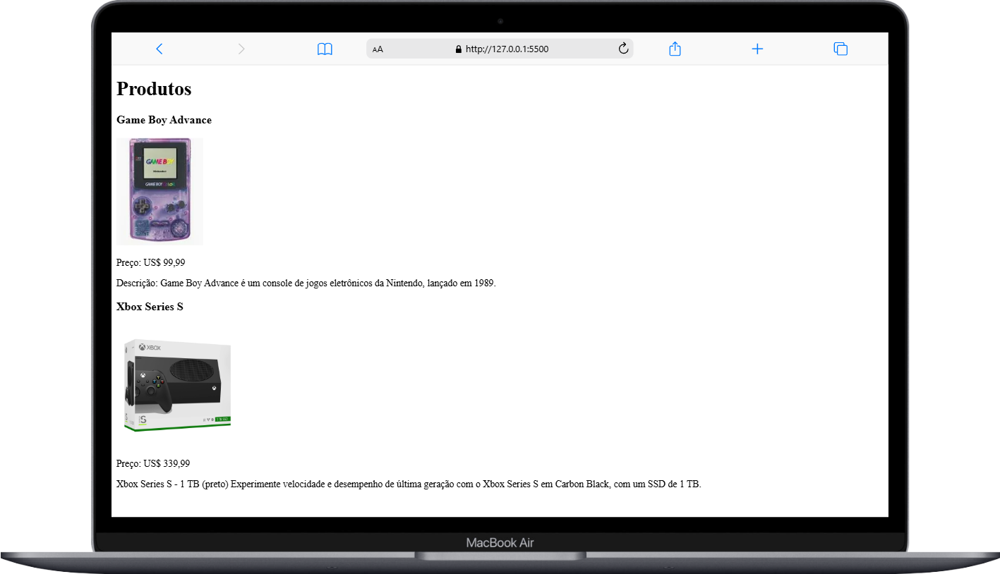

# Projeto: Adicionar tags HTML e preencher com conteúdos por meio do JavaScript

## Descrição: 

Crie um projeto com dois arquivos: index.html e script.js. No arquivo 'index' insira apenas a estrutura base HTML e a tag script para conectar o arquivo HTML com o arquivo de extensão JavaScript.

Usando os conceitos aprendidos nesse módulo, e sem alterar o arquivo index.html, adicione um título simples ao site com o id 'titulo', e um elemento que represente um produto à venda. O produto precisa incluir pelo menos o nome, a descrição e o preço. Pode incluir outros "elementos filhos" se achar necessário como, por exemplo, uma imagem. Procure usar o método simples e o método complexo, ensinados neste tópico.

A estrutura do projeto é composta por dois arquivos principais:

- `index.html`: Contém a estrutura padrão de um documento HTML.
- `script.js`: Contém o código JavaScript que cria e manipula elementos HTML utilizando diferentes métodos de seleção e manipulação do DOM.

## Screenshots





## Estrutura do Projeto

### index.html

```
<!DOCTYPE html>
<html lang="pt-br">
<head>
    <meta charset="UTF-8">
    <meta name="viewport" content="width=device-width, initial-scale=1.0">
    <script src="./script.js" defer></script>
    <title>Criando elementos</title>
</head>
<body>
    
</body>
</html>
```

## script.js 

```
// Método simples
let titulo = document.createElement('h1');
titulo.id = 'titulo';
titulo.textContent = 'Produtos';

document.body.appendChild(titulo);

let produtoUm = document.createElement('div');
produtoUm.id = 'produto-um';
document.body.appendChild(produtoUm);

let subTituloGameBoy = document.createElement('h3');
subTituloGameBoy.id ='sub-titulo';
subTituloGameBoy.textContent = 'Game Boy Advance';

let imagemGameBoy = document.createElement('img');
imagemGameBoy.id = 'imagem';
imagemGameBoy.src = 'https://encrypted-tbn0.gstatic.com/shopping?q=tbn:ANd9GcSlryN-UmGUupt-lzuCogzQGxLeqvnI2F_LQXdk-Uymhe4v0S6QYZgJ-71DuuiSc04gf6KujgRt7U1WSR1KYILXK_VDgtglnljymKG9e3njv1OcnRC2GAZ85G6PTFpy2i6_R0P7wttBOaM&usqp=CAc';

let precoGameBoy = document.createElement('p');
precoGameBoy.id = 'preco';
precoGameBoy.textContent = 'Preço: US$ 99,99';

let descricaoGameBoy = document.createElement('p');
descricaoGameBoy.id = 'descricao';
descricaoGameBoy.textContent = 'Descrição: Game Boy Advance é um console de jogos eletrônicos da Nintendo, lançado em 1989.';

produtoUm.append(subTituloGameBoy, imagemGameBoy, precoGameBoy, descricaoGameBoy);

// Método complexo

let produtoDois = document.createElement('div');
produtoDois.id = 'produto-dois';
document.body.appendChild(produtoDois);

produtoDois.innerHTML = `
    <h3 id="sub-titulo">Xbox Series S</h3>
    
    <p id="preco">Preço: US$ 339,99</p>
    <p id="descricao">Xbox Series S - 1 TB (preto) Experimente velocidade e desempenho de última geração com o Xbox Series S em Carbon Black, com um SSD de 1 TB.</p>
`
```

## Funcionalidade do script.js

O arquivo script.js manipula diversos elementos HTML da seguinte forma:

1. Adicionando um Título:
    ```
    let titulo = document.createElement('h1');
    titulo.id = 'titulo';
    titulo.textContent = 'Produtos';
    document.body.appendChild(titulo);
    ```
    - Cria um elemento `<h1>` com o ID `titulo` e texto "Produtos" e o adiciona ao `body`.

2. Adicionando um Produto - Game Boy Advance:
    ```
    let produtoUm = document.createElement('div');
    produtoUm.id = 'produto-um';
    document.body.appendChild(produtoUm);

    let subTituloGameBoy = document.createElement('h3');
    subTituloGameBoy.id ='sub-titulo';
    subTituloGameBoy.textContent = 'Game Boy Advance';

    let imagemGameBoy = document.createElement('img');
    imagemGameBoy.id = 'imagem';
    imagemGameBoy.src = 'https://encrypted-tbn0.gstatic.com/shopping?q=tbn:ANd9GcSlryN-UmGUupt-lzuCogzQGxLeqvnI2F_LQXdk-Uymhe4v0S6QYZgJ-71DuuiSc04gf6KujgRt7U1WSR1KYILXK_VDgtglnljymKG9e3njv1OcnRC2GAZ85G6PTFpy2i6_R0P7wttBOaM&usqp=CAc';

    let precoGameBoy = document.createElement('p');
    precoGameBoy.id = 'preco';
    precoGameBoy.textContent = 'Preço: US$ 99,99';

    let descricaoGameBoy = document.createElement('p');
    descricaoGameBoy.id = 'descricao';
    descricaoGameBoy.textContent = 'Descrição: Game Boy Advance é um console de jogos eletrônicos da Nintendo, lançado em 1989.';

    produtoUm.append(subTituloGameBoy, imagemGameBoy, precoGameBoy, descricaoGameBoy);
    ```
    - Cria uma estrutura de produto com título, imagem, preço e descrição para o "Game Boy Advance" e o adiciona ao `body`.

3. Adicionando um Produto - Xbox Series S(Método complexo):
    ```
    let produtoDois = document.createElement('div');
    produtoDois.id = 'produto-dois';
    document.body.appendChild(produtoDois);

    produtoDois.innerHTML = `
        <h3 id="sub-titulo">Xbox Series S</h3>
        
        <p id="preco">Preço: US$ 339,99</p>
        <p id="descricao">Xbox Series S - 1 TB (preto) Experimente velocidade e desempenho de última geração com o Xbox Series S em Carbon Black, com um SSD de 1 TB.</p>`;
    ```

## Instruções para Rodar o Projeto

Siga as instruções abaixo para rodar o projeto e verificar as manipulações do DOM:

1. Clone o repositório ou faça o download dos arquivos do projeto.

2. Abra o arquivo index.html em um navegador web.
    - Você pode fazer isso de duas formas:

        - Clique duas vezes no arquivo index.html para abri-lo diretamente no navegador padrão.

        - Abra o navegador de sua preferência e arraste o arquivo index.html para a janela do navegador.

3. Verifique as alterações na página.
    - O título da página deverá estar como "Produtos".
    - Deve haver dois produtos listados: "Game Boy Advance" e "Xbox Series S", cada um com sua respectiva imagem, preço e descrição.